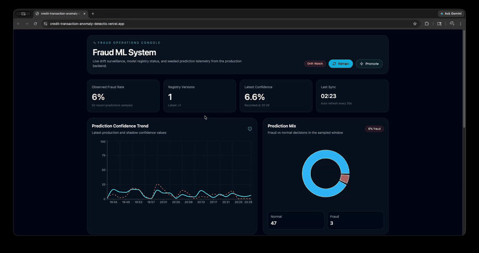

# Credit Transaction Anomaly Detection System with Drift-Triggered Retraining

## 🧠 What This System Does
This is a production-style ML system that:
- Detects anomalous credit card transactions
- Monitors real-time data drift using distributional metrics (KL divergence)
- Automatically triggers retraining when drift exceeds a threshold
- Maintains a model registry with version control and promotion workflows
---
## ⚙️ Core Insight
Traditional ML systems degrade silently under data drift.
This system treats drift as a first-class signal, enabling:
- proactive retraining
- continuous reliability
- observable model behavior
---
## 🔍 System Flow
Input → Prediction → Drift Monitoring → Retraining Trigger → Model Promotion

---

This repository is organized as a monorepo with separate deployment roots for the FastAPI backend and the Next.js frontend.

## Structure

```text
.
├── backend/
│   ├── api/
│   ├── data/
│   ├── models/
│   ├── monitoring/
│   ├── retraining/
│   ├── training/
│   ├── analyze_data.py
│   ├── smoke_test.py
│   ├── Procfile
│   ├── requirements.txt
│   └── runtime.txt
├── frontend/
│   ├── app/
│   ├── public/
│   ├── .env.example
│   ├── next.config.js
│   └── package.json
└── README.md
```

## Data

The raw dataset is not committed. Download `creditcard.csv` from Kaggle and place it in [`backend/data/`](/Users/shubhankartiwari/Credit-Transaction-Anomaly-Detection-System-with-Drift-Triggered-Retraining/backend/data/README.md).

## Local Setup

### Backend

1. `python -m venv .venv`
2. `source .venv/bin/activate`
3. `pip install -r backend/requirements.txt`
4. `cd backend`
5. `python training/preprocess.py`
6. `python training/train.py`
7. `PYTHONPATH=. uvicorn api.main:app --reload --host 0.0.0.0 --port 8000`

### Frontend

1. `cd frontend`
2. `cp .env.example .env.local`
3. `npm install`
4. `npm run dev`

The frontend reads the API base URL from `NEXT_PUBLIC_API_BASE_URL`.

## Deployment

- Railway: set the project root directory to `backend/`.
- Vercel: set the project root directory to `frontend/`.

## Live Deployment

- **Backend**: https://credit-transaction-anomaly-detection.onrender.com
- **Frontend**: https://credit-transaction-anomaly-detectio.vercel.app

## Demo



## API Endpoints

- `POST /predict`
- `GET /metrics`
- `GET /registry`
- `POST /retrain`
- `POST /promote`
- `GET /predictions?limit=100`
