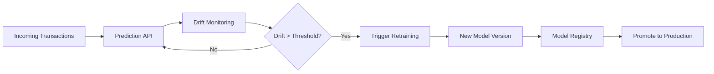

# Drift-Aware Model Governance Pipeline for Credit Fraud Detection

## 🏦 Production Use Case
This repository implements a **drift-aware model governance pipeline with business-aware promotion decisions** for credit transaction fraud detection. As transaction behavior evolves, the system monitors data drift, evaluates candidate models against production, and only promotes when model governance rules and business loss thresholds are met.

## 🧠 What This System Does
This is a complete ML Ops control system that:
- Detects anomalous credit card transactions using an **XGBoost** classifier
- Monitors real-time data drift using distributional metrics (KL divergence & Population Stability Index)
- Automatically executes an **ML Control Loop**: `drift_detected -> retrain -> evaluate -> promote`
- Maintains a model registry with an explicit **Model Governance Layer** (comparing Production vs Candidate AUC and business-aware threshold-optimized deployment decisions)

---

## 💡 Key Insight & Results

**Key Insight:**
This system demonstrates how distributional drift directly degrades model performance, and how an automated, shadow-deployed retraining pipeline restores predictive accuracy.

**Results:**
- **Baseline AUC-ROC:** `0.97+`
- **After Drift Detected:** `~0.82` (Simulated ~15% performance degradation on out-of-distribution data)
- **After Automated Recovery:** `0.97+` (Candidate model promoted successfully)

---

## 🔄 System Flow



---

## 📊 Key Results
- Drift detection using KL divergence with real-time tracking
- Retraining triggered automatically when drift exceeds threshold
- Cooldown mechanism prevents unstable retraining loops
- Observability: drift timeline + prediction distribution visualization
- Shadow model deployment enables safe A/B comparison before promotion

## 🔁 System Architecture
Data → Drift Detection → Retrain → Shadow Evaluation → Threshold Optimization → Business Loss Comparison → Decision → Registry Update → Inference with Learned Threshold

## ⚠️ Failure & Governance Scenarios
- Candidate model can have better AUC but worse business loss, and will be rejected
- If the optimized threshold is unstable, the system chooses `no_change` rather than promoting
- Drift detected within cooldown window is logged but does not trigger retraining

---

## 🧠 Design Decisions
- **KL Divergence** used for drift detection due to sensitivity to distribution changes
- **Cooldown mechanism** added to avoid retraining instability under noisy drift signals
- **Feature shift explanation** improves interpretability of drift (surfaces top shifted feature)
- **Model registry** enables controlled promotion and rollback via shadow deployments
- **Failure handling** in retraining pipeline ensures system resilience and observable error state

---

## Demo


---

## Structure

```text
.
├── backend/
│   ├── api/            # FastAPI endpoints (predict, drift, retrain, health)
│   ├── data/           # Processed data, logs, drift history
│   ├── models/         # Trained models, registry, retrain status
│   ├── monitoring/     # Drift computation (KL, PSI), prediction logging
│   ├── retraining/     # Retrain trigger, cooldown, shadow deploy, promotion
│   ├── training/       # Preprocessing and model training scripts
│   ├── Procfile
│   ├── requirements.txt
│   └── runtime.txt
├── frontend/
│   ├── app/            # Next.js dashboard (drift, registry, charts)
│   ├── public/
│   ├── .env.example
│   ├── next.config.js
│   └── package.json
└── README.md
```

## Data

The raw dataset is not committed. Download `creditcard.csv` from [Kaggle](https://www.kaggle.com/datasets/mlg-ulb/creditcardfraud) and place it in `backend/data/`.

## Local Setup

### Backend

```bash
python -m venv .venv
source .venv/bin/activate
pip install -r backend/requirements.txt
cd backend
python training/preprocess.py
python training/train.py
PYTHONPATH=. uvicorn api.main:app --reload --host 0.0.0.0 --port 8000
```

### Frontend

```bash
cd frontend
cp .env.example .env.local
npm install
npm run dev
```

The frontend reads the API base URL from `NEXT_PUBLIC_API_URL`.

## API Endpoints

| Method | Endpoint | Description |
|--------|----------|-------------|
| `POST` | `/predict` | Run fraud prediction on a transaction |
| `GET` | `/drift` | Current drift score, status, threshold |
| `GET` | `/drift/history` | Drift score timeline |
| `GET` | `/metrics` | Raw drift metrics (KL, PSI) |
| `POST` | `/retrain` | Trigger model retraining |
| `GET` | `/retrain/status` | Last retrain result and metadata |
| `POST` | `/promote` | Promote shadow model to production |
| `GET` | `/registry` | Model version registry |
| `GET` | `/predictions` | Recent prediction logs |
| `GET` | `/health` | System health check |

## Deployment

- **Backend (Render)**: set the project root directory to `backend/`.
- **Frontend (Vercel)**: set the project root directory to `frontend/`.

## Live Deployment

- **Backend**: https://credit-transaction-anomaly-detection.onrender.com
- **Frontend**: https://credit-transaction-anomaly-detectio.vercel.app
